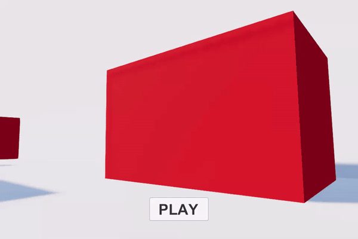
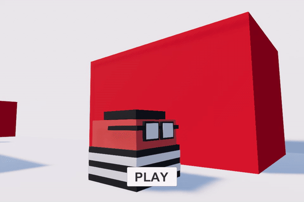

# Endless Runner Template Unity
 A simple endless runner template for Unity.

 
 Features:
 - camera system (using cinemachine)
 - camera transition (similar to subway-surfer)
 

 - endless environment (recycling existing patches to create an endless environment)
 - chase AI (basic follow behaviour)
 - obstacle avoidance (used for AI to decide when and where to move when there is a blockage ahead of it)
 

  
 - some bonus scripts (fancy word for residue)
 - lives sidewall bumps (gives you a inspector friendly value to use as a health of some sort when colliding with sidewalls)
 
 Soon to come:
 - jump and duck behaviour
 - different AI implementations (say, police choppers and tanks? who knows!)
 - some UI, particle effects and sounds
